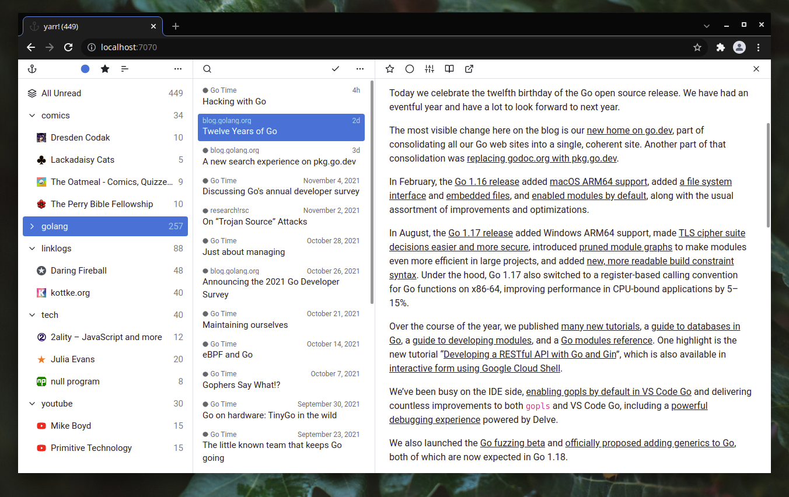

# yarr

**yarr** (yet another rss reader) is a web-based feed aggregator which can be used both
as a desktop application and a self-hosted server.

It is written in Go with the frontend in Vue.js. The storage is backed by SQLite.

[download](https://github.com/nkanaev/yarr/releases/latest)
| [build](doc/build.md)

## credits

[Feather](http://feathericons.com/) for icons.
