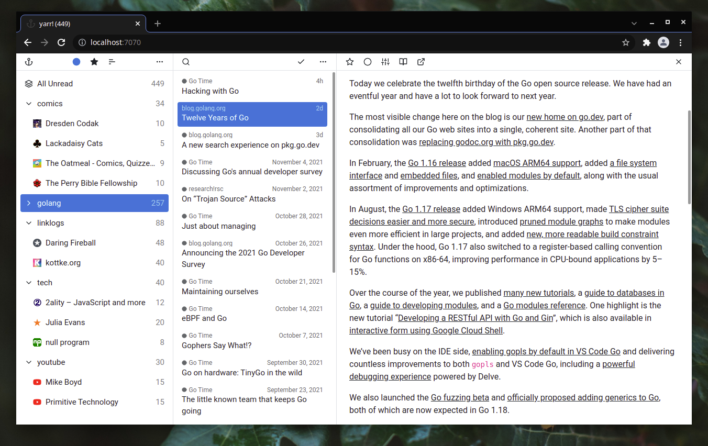

# yarr

**yarr** (yet another rss reader) is a web-based feed aggregator which can be used both
as a desktop application and a personal self-hosted server.

The app is a single binary with an embedded database (SQLite).



## usage

The latest prebuilt binaries for Linux/MacOS/Windows are available
[here](https://github.com/nkanaev/yarr/releases/latest).
The archives follow the naming convention `yarr_{OS}_{ARCH}[_gui].zip`, where:

* `OS` is the target operating system
* `ARCH` is the CPU architecture (`arm64` for AArch64, `amd64` for X86-64)
* `-gui` indicates that the binary ships with the GUI (tray icon), and is a command line application if omitted

Usage instructions:

* MacOS: place `yarr.app` in `/Applications` folder, [open the app][macos-open], click the anchor menu bar icon, select "Open".

* Windows: open `yarr.exe`, click the anchor system tray icon, select "Open".

* Linux: place `yarr` in `$HOME/.local/bin` and run [the script](etc/install-linux.sh).

[macos-open]: https://support.apple.com/en-gb/guide/mac-help/mh40616/mac

For self-hosting, see `yarr -h` for auth, tls & server configuration flags.

## deploying with once

yarr is compatible with [Basecamp Once](https://github.com/basecamp/once). To deploy with authentication:

```sh
docker run -d \
  -p 80:80 \
  -v yarr-data:/storage \
  -e SECRET_KEY_BASE="your-secret-key" \
  -e YARR_AUTH="username:password" \
  ghcr.io/sroberts/yarr:once-latest
```

Once mounts a persistent volume at `/storage` automatically. The database is stored at `/storage/db/yarr.db`.

### environment variables

| Variable | Description |
|---|---|
| `YARR_AUTH` | Username and password in `username:password` format |
| `SECRET_KEY_BASE` | Secret key for session token signing (provided by Once) |
| `DISABLE_SSL` | Set to `true` when running behind a reverse proxy that handles TLS (set by default in the Once image) |

The Once image listens on port 80 and includes backup/restore hooks for safe SQLite snapshots. A health check is available at `GET /up`.

See more:

* [Building from source code](doc/build.md)
* [Fever API support](doc/fever.md)

## credits

[Feather](http://feathericons.com/) for icons.
