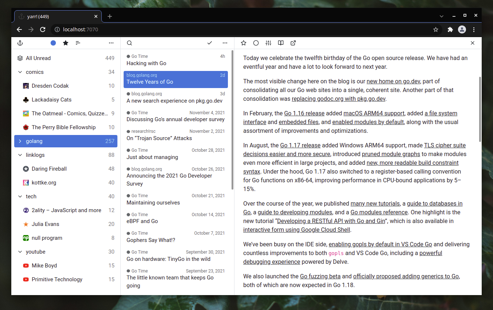

# yarr

**yarr** (yet another rss reader) is a web-based feed aggregator.

* Single binary, no dependencies
* Cross-platform - Windows / macOS / Linux
* Desktop app or Self-hosted
* SQLite or Postgres

  <a href="https://nkanaev.github.io/yarr/en/">documentation</a> / 
  <a href="https://github.com/nkanaev/yarr/releases">releases</a>
    (<a href="https://github.com/nkanaev/yarr/releases.atom">feed</a>)

